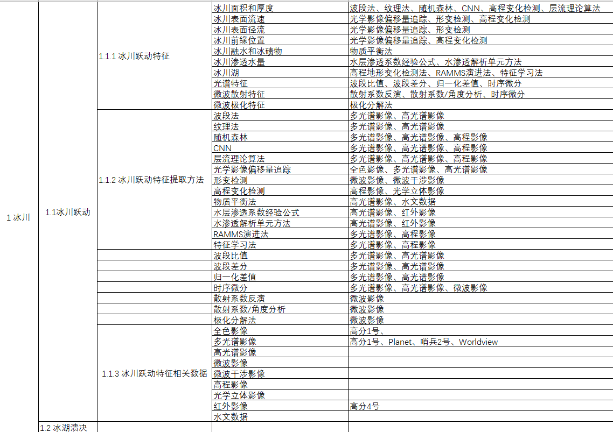

项目地址(https://github.com/lcc-01/KnowledgeGroup)    

# 1、文献搜集  
  
搜集文献，参考《六要素数据工程软件化材料提供》，将找到的信息整理为Word文档，参考格式如下： 


文档的结果如下：  
  
```
冰川跃动
    |--特征
    |    |--冰川面积和厚度
    |    |    |--可以用什么方法获得
    |    |--...
    |--方法
    |    |--波段法
    |    |    |--使用什么数据
    |    |--...
    |--数据
    |    |--高光谱影像
    |    |    |--数据类型
    |    |    |--获取链接（卫星以及网址）
```  
  
在整理过程中，对每个特征、每种方法、每个数据要有描述，说明方法的具体实现、数据的类型以及获取方式。

# 2、建立表格

根据Word文档，对冰川跃动、冰湖溃决、冻融滑坡、洪水泥石流、流动沙丘、冰崩雪崩六个方面的数据进行整理，参考下图格式汇总成为Excel表格。  
  



分级结构如下：  
```  
要素  
    |--冰川  
    |    |--冰川跃动  
    |    |    |--特征  
    |    |    |    |--方法  
    |    |    |--方法  
    |    |    |    |--数据  
    |    |    |--数据  
    |    |    |    |--获取方式  
    |    |--冰湖溃决  
    |    |    |--特征  
    |    |    |    |--方法  
    |    |    |--方法  
    |    |    |    |--数据  
    |    |    |--数据  
    |    |    |    |--获取方式  
    |--冻土  
    |    |--冻融滑坡  
    |    |    |--...  
    |    |--洪水泥石流  
    |    |    |--...  
    |--沙漠  
    |    |--流动沙丘  
    |    |    |--...  
    |--积雪  
    |    |--冰崩雪崩  
    |    |    |--...  
    |    |--道路灾害  
    |    |    |--...  
```  

提交Word文档和Excel表格，对其中的名称进行统一，避免混淆和歧义。  
  
# 3、知识图谱构建  
  
在KnowledgeGroup文件夹下以名称为文件名建立.md文件，.md文件为Markdown文件，可以用记事本、VScode、typora等工具进行编辑。  
编辑完成后，将文件夹打包汇总，使用Obsidian形成知识图谱，并发布在网站上（[冰川跃动](https://publish.obsidian.md/glacier/)）。  
  
目录格式如下：  
  
```  
KnowledgeGroup  
    |--Attachment  
    |    |--图片存放文件夹  
    |--Data  
    |    |--目录  
    |    |    |--一级目录  
    |    |    |    |--冰川.md  
    |    |    |--二级目录  
    |    |    |    |--冰川跃动.md  
    |    |    |    |--冰湖溃决.md  
    |    |    |--...  
    |    |--特征  
    |    |    |--冰川跃动特征  
    |    |    |    |--冰川面积和厚度.md  
    |    |    |    |--冰川表面流速.md  
    |    |    |    |--...  
    |    |    |--冰湖溃决特征  
    |    |    |    |--...  
    |    |--方法  
    |    |    |--波段法.md  
    |    |    |--CNN.md  
    |    |    |--...  
    |    |--相关数据  
    |    |    |--高光谱影像.md  
    |    |    |--高程影像.md  
    |    |    |--...  
    |    |--研究对象  
    |    |    |--冰川  
    |    |    |    |--克亚吉尔冰川.md  
    |    |    |    |--唯格勒当雄冰川.md  
    |    |    |--冰湖  
    |    |    |    |--...  
    |    |--数据集  
    |    |    |--Sentinel.md  
    |    |    |--Landsat.md  
    |    |    |--...  
```

  
文件格式如下：  
  
---  

正文:  

…………………………………………………………
  
父节点  
[[该文件的所有上级文件]]  


子节点  
[[与该文件直接联系的文件]]  
  
---  
  
示例  
  
KnowledgeGroup\\Data\\方法\\随机森林.md  
  
---  
  
随机森林算法是一种集成学习方法，通过整合多个决策树模型来进行预测或分类。随机森林算法的核心思想是通过随机选择样本和特征，构建多个决策树，并且通过综合多个决策树的预测结果来得出最终的结果。  
在随机森林中，每棵树都是独立并且随机地从原始数据中抽取样本和特征进行训练。这种随机性有助于减少过拟合，并提高模型的泛化能力。同时，随机森林还可以处理具有大量输入特征的数据集，并能够评估各个特征的重要性。  
随机森林算法在实际应用中具有较好的性能，并且对于处理复杂的分类和回归问题具有良好的适应性。它在数据挖掘、机器学习和预测建模等领域中得到了广泛的应用。  

  
  
[[冰川]]  
[[冰川跃动]]  
[[冰川面积和厚度]]  
  
  
[[多光谱影像]]  
[[高光谱影像]]  
[[高程影像]]  
  

